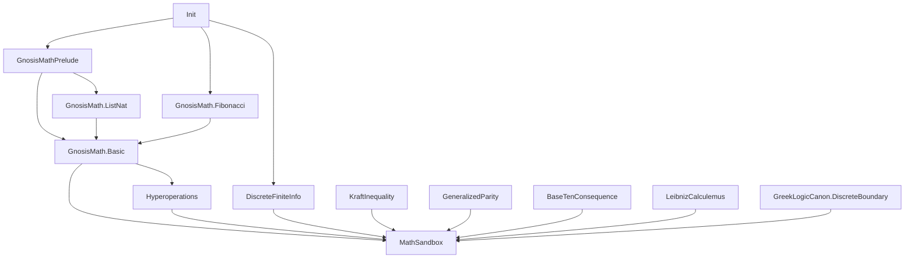

# GnosisMath dependency graph (Init-only)

- Parent: [README.md](./README.md)
- Math sandbox policy: [MATH_SANDBOX.md](./MATH_SANDBOX.md)

Directed edges mean **imports** (arrow points from importer → importee).

Arrows point **into** the importer: e.g. `KraftInequality --> MathSandbox` means `MathSandbox` imports `KraftInequality`.

| Module | Imports | Role |
|--------|---------|------|
| [`GnosisMathPrelude.lean`](../lean/Lean/ForkRaceFoldTheorems/GnosisMathPrelude.lean) | `Init` | `powNat`, base `Nat` lemmas |
| [`GnosisMath/ListNat.lean`](../lean/Lean/ForkRaceFoldTheorems/GnosisMath/ListNat.lean) | `GnosisMathPrelude` | `powNat_mul_distrib`, list length lemmas |
| [`GnosisMath/Fibonacci.lean`](../lean/Lean/ForkRaceFoldTheorems/GnosisMath/Fibonacci.lean) | `Init` | `fibZ` tower (same equations as [`ZeckendorfFST.F`](../lean/Lean/ForkRaceFoldTheorems/ZeckendorfFST.lean), Init-only) |
| [`DiscreteFiniteInfo.lean`](../lean/Lean/ForkRaceFoldTheorems/DiscreteFiniteInfo.lean) | `Init` | `finSum`, `MassVec`, `ratFinSum`, `probRat` (Init-only thermo-shaped discrete layer) |
| [`GnosisMath/Basic.lean`](../lean/Lean/ForkRaceFoldTheorems/GnosisMath/Basic.lean) | `GnosisMathPrelude`, `ListNat`, `Fibonacci` | StructuralErrorgle barrel `import` for sandbox consumers |
| [`Hyperoperations.lean`](../lean/Lean/ForkRaceFoldTheorems/Hyperoperations.lean) | `GnosisMath.Basic` | Hyperoperation hierarchy (`hyperop`, `powNat`) |
| [`MathSandbox.lean`](../lean/Lean/MathSandbox.lean) | `GnosisMath.Basic`, `DiscreteFiniteInfo`, Kraft / parity / …, `GreekLogicCanon.DiscreteBoundary` | CI-visible Init-first hub |
| [`ZeckendorfFST.lean`](../lean/Lean/ForkRaceFoldTheorems/ZeckendorfFST.lean) | `Init` | Standalone Zeckendorf / Pisot–Vickrey FST substrate (`F`, `decode`, `smooth`, …); not imported by `MathSandbox` |

**Rule:** Init-only sandbox roots (see [`init-only-import-closure.json`](../scripts/init-only-import-closure.json)) must not transitively import `Mathlib` (enforced by `scripts/validate-init-only-import-closure.mjs`; `pnpm run validate:lean-minimal` runs the Lake package + this check).
