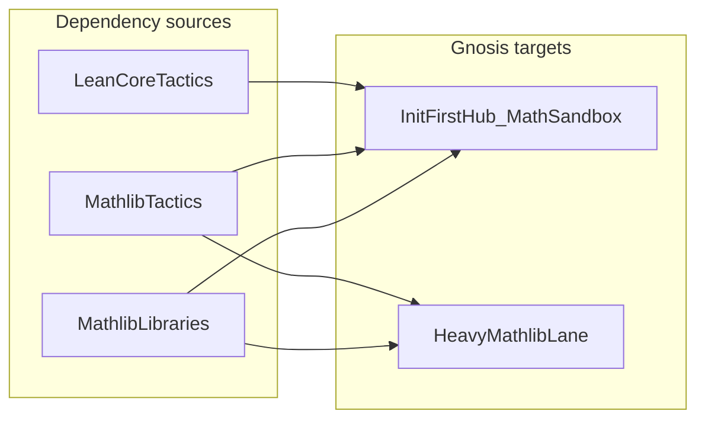

# Init-first Mathlib replacement roadmap

- Parent: [README.md](./README.md)
- Math sandbox hub: [MATH_SANDBOX.md](./MATH_SANDBOX.md)
- Vs Mathlib / Std: [MATH_SANDBOX_VS_MATHLIB.md](./MATH_SANDBOX_VS_MATHLIB.md)
- Contributing (avoid Mathlib creep): [MATH_SANDBOX_CONTRIBUTING.md](./MATH_SANDBOX_CONTRIBUTING.md)
- Partial peel example: [PISOT_VICKREY_PEEL.md](./PISOT_VICKREY_PEEL.md)

“Replacing Mathlib” is **not** one problem. This roadmap separates **redundant imports**, **Mathlib-only tactics**, and **Mathlib mathematical libraries**, and sequences work so each step is **checkable** against the existing Init-first CI contract.

## Executive summary

| Problem class | What it is | Typical fix |
|---------------|------------|-------------|
| **A — Redundant tactic imports** | `import Mathlib.Tactic` (or similar) while proofs only use **Lean core** tactics | Peel to `import Init` (or the smallest structural import that builds); no new lemmas |
| **B — Mathlib-only tactics** | Goals that need `ring`, `linarith`, `norm_num`, `interval_cases`, `positivity`, `field_simp`, … | Init-first proofs (`simp`/`omega`/`decide`/explicit lemmas), **or** keep Mathlib on that file until a lemma is ported |
| **C — Mathlib libraries** | `Mathlib.Analysis.*`, measure/probability, big operators on fintypes, linear algebra, … | Port **minimal** lemmas into `GnosisMath*` / local modules, **split** modules behind optional imports, **or** document a **heavy lane** that keeps Mathlib |

**Important:** `omega` for linear `Nat` / `Int` arithmetic is provided by **Lean core** (tactic surface in the `Init` / tactics stack; elaboration under `Lean.Elab.Tactic.Omega`). It is **not** Mathlib-only. Example in-repo: [`KraftInequality.lean`](../lean/Lean/ForkRaceFoldTheorems/KraftInequality.lean) uses `import Init` and `by omega`. Many files still import `Mathlib.Tactic` only out of habit; [`AeonVoting.lean`](../lean/Lean/ForkRaceFoldTheorems/AeonVoting.lean) is a candidate for **import hygiene** if proofs stay on `omega` + basic `simp`.

## Replacement matrix

### No replacement (use core / Init)

- **`omega`** — core linear arithmetic (see above).
- **Basic proof automation** available from the standard stack: `simp`, `rw`, `exact`, `apply`, `decide`, `grind` (as supported by your pinned Lean), etc., with `import Init` or your minimal prelude.

These cover a large share of “`import Mathlib.Tactic` but nothing fancy” debt.

### Tactic-level: Mathlib-only (substitute deliberately)

| Tactic (examples) | Direction |
|-------------------|-----------|
| `ring` | Algebraic normalization; often replaceable with explicit rewrites + `simp` + `omega` on small goals, or a **local** ring lemma. |
| `linarith` | Linear inequalities beyond `omega`’s sweet spot; try `omega` first, then explicit case splits / lemmas. |
| `norm_num` | Numeric normalization; ground goals may close with `decide` / `native_decide` after `simp`. |
| `interval_cases` | Finite case splits; manual `cases` / recursion on `Nat` / `Fin` with Init lemmas. |
| `positivity` | Sign goals; explicit lemmas on `Nat`/`Int`/`Rat` + `omega`. |
| `field_simp` | Field identities; heavy — often **keep Mathlib** for that file or isolate a tiny lemma module. |

When a file mixes **one** hard tactic with otherwise Init-first code, prefer **documenting the boundary** (see [PISOT_VICKREY_PEEL.md](./PISOT_VICKREY_PEEL.md)) over half-porting.

### Library-level: domains, not tactics

- **Analysis / calculus / ODEs** — see [PHYSICS_SANDBOX.md](./PHYSICS_SANDBOX.md) for the Mathlib-backed “showcase” lane and disclaimers.
- **Thermo / KL / PMF / ENNReal** — see the Thermo/KL rows in [MATH_SANDBOX.md](./MATH_SANDBOX.md); these are **not** expected to become Init-only in one step.
- **`import Mathlib` monoliths** (e.g. [`GreekLogicCanon.lean`](../lean/Lean/ForkRaceFoldTheorems/GreekLogicCanon.lean)) — follow the **split / fork** plan already in [MATH_SANDBOX.md](./MATH_SANDBOX.md): slice imports, peel per section, promote Init-first cores where honest.

Arrows mean “may feed” — library lemmas can be **ported** into the Init-first hub when the cost is justified; tactics are either **eliminated** or the file stays in the heavy lane.

## Phased roadmap

### Phase 0 — Inventory

For each file under `open-source/gnosis/lean/Lean/` that imports `Mathlib`, record:

- **Import shape:** `Mathlib.Tactic` only vs specific `Mathlib.Tactic.*` vs broad `Mathlib.*`.
- **Actual tactics used** (grep / manual pass): e.g. `omega` vs `ring` vs `linarith`.
- **Classification:** A (redundant), B (tactic substitution), C (library).

Deliverable: a short table or checklist (can live in this file as an appendix later, or in a PR description — avoid duplicating full file lists unless maintained).

### Phase 1 — Import hygiene (low risk)

- Replace `import Mathlib.Tactic` with `import Init` (or the minimal import that preserves the proof) when Phase 0 shows **only** core tactics.
- **After peeling**, you may still need small name fixes Mathlib used to open implicitly: e.g. `Nat.lt_of_lt_of_le` instead of `lt_of_lt_of_le`, `congrArg` instead of `congr_arg`. Files using `ℕ` notation, `deriving Fintype`, or `nlinarith` / `linarith` are **not** tactic-only—keep Mathlib imports or refactor (see `UnspeechTriton`, `PisotComplexity` in-repo).
- Rebuild touched libraries: `lake build <target>` in `open-source/gnosis/lean` (see [lakefile](../lean/lakefile.lean)).
- Run the Init-only pipeline where applicable: `pnpm run validate:lean-minimal` from `open-source/gnosis` ([lean-minimal README](../lean-minimal/README.md)). The minimal Lake package lists **explicit roots** for modules like `DiscreteFiniteInfo` so Lake builds them before [`MathSandbox`](../lean-minimal/lakefile.lean) (see comment in that file).

### Phase 2 — Tactic substitution

- For Phase-B files, replace Mathlib tactics with Init-first proofs or **local** helper lemmas under `ForkRaceFoldTheorems/` / `GnosisMath*` per [MATH_SANDBOX_CONTRIBUTING.md](./MATH_SANDBOX_CONTRIBUTING.md).
- Prefer **small lemmas** over growing a second Mathlib.

### Phase 3 — Domain shrink

- For each Phase-C module: choose **port minimal lemmas**, **split module** (optional imports), or **keep Mathlib** and document the boundary in [MATH_SANDBOX.md](./MATH_SANDBOX.md) / [PHYSICS_SANDBOX.md](./PHYSICS_SANDBOX.md).

### Phase 4 — Monoliths

- Files with `import Mathlib`: use the **GreekLogicCanon-style** fork/split strategy in [MATH_SANDBOX.md](./MATH_SANDBOX.md) — no duplicate policy here.

## Non-goals

- **Do not** reimplement Lean’s core `omega` or full `linarith` / `ring` as a “Gnosis Omega” unless there is a new **hard** constraint (trust model, kernel surface, etc.). Prefer core tactics + local lemmas.
- **Do not** treat “Init-first everywhere” as mandatory for **heavy lanes** already called out in sandbox docs — honesty about scope beats pretend completion.

## Verification (CI contract)

Init-first roots are configured in [`init-only-import-closure.json`](../scripts/init-only-import-closure.json) and enforced by [`validate-init-only-import-closure.mjs`](../scripts/validate-init-only-import-closure.mjs).

| Check | Command / pointer |
|-------|-------------------|
| Math hub | `lake build MathSandbox` in `open-source/gnosis/lean` |
| Init-only roots | `pnpm run validate:lean-minimal` — see [MATH_SANDBOX.md](./MATH_SANDBOX.md) § CI / build |
| Dependency graph narrative | [GNOSIS_MATH_DEPENDENCY_GRAPH.md](./GNOSIS_MATH_DEPENDENCY_GRAPH.md) |

After Phase 1–2 edits, run the **smallest** proof check that covers changed modules before widening.

## See also

- [ZECKENDORF_FST_PEEL.md](./ZECKENDORF_FST_PEEL.md) — standalone Init substrate.
- [FORMAL_LEDGER.md](../FORMAL_LEDGER.md) — formal index for the repo.
